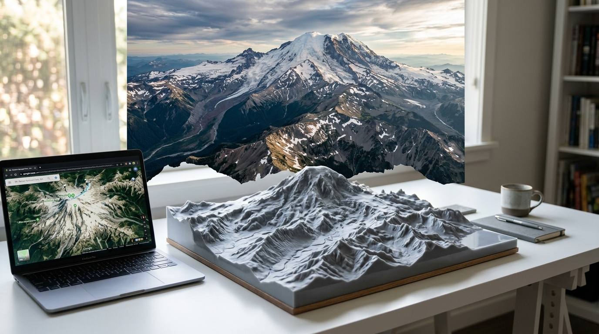

# map-generator

Convert any Google Maps URL into a 3D-printable STL model of the real terrain.

## Overview

**map-generator** takes a Google Maps URL and generates a watertight STL file of the terrain, ready to send to your 3D printer. The tool automatically fetches real elevation data (OpenTopography Copernicus COP30 at 30 m/px with Open-Meteo as a keyless fallback), builds a printable mesh with a flat sealed base, and writes a hillshade preview PNG and a JSON sidecar alongside the STL.

No Google terrain data is used — only open DEM sources.

## Installation

```bash
git clone https://github.com/darrenoakey/map-generator.git
cd map-generator
pip install -e .
```

### Optional: OpenTopography API key (higher resolution)

Store a free API key from [portal.opentopography.org](https://portal.opentopography.org/) in the macOS Keychain:

```bash
security add-generic-password -s map-generator-opentopography -w YOUR_KEY
```

Without a key the tool falls back to Open-Meteo automatically.

## Usage

```
map-generator generate <URL> [OPTIONS]
map-generator <URL> [OPTIONS]          # shorthand — 'generate' is implicit
map-generator inspect-url <URL>        # dry-run: print coords/bbox without fetching
```

### Options

| Option | Default | Description |
|--------|---------|-------------|
| `-o, --output` | `map.stl` | Output STL filename |
| `--source` | `auto` | Elevation source: `auto` \| `opentopography` \| `open-meteo` |
| `--z-scale` | `1.8` | Vertical exaggeration |
| `--base-mm` | `4.0` | Sealed base thickness in mm |
| `--print-mm` | `100.0` | Physical footprint side length in mm |
| `--no-cache` | off | Skip elevation cache |
| `--verify` | off | Print watertight/volume/Euler validation |
| `-v, --verbose` | off | Verbose output |

## Examples

```bash
# Generate a model from a Google Maps URL
map-generator 'https://www.google.com/maps/place/32+Mitchell+Cres,+Warrawee+NSW+2074/@-33.7368286,151.1084364,2934m/...' -o warrawee.stl

# High z-scale for flat terrain
map-generator 'https://maps.google.com/...' -o flat_area.stl --z-scale 4.0

# Inspect URL without fetching elevation
map-generator inspect-url 'https://maps.google.com/...'
```

## Output Files

Each run produces three files alongside the STL:

| File | Description |
|------|-------------|
| `output.stl` | Watertight binary STL, flat sealed base, four walls, terrain surface |
| `output.json` | Sidecar: bbox, elevation source/license, grid dims, scale params |
| `output.png` | Hillshade preview of the elevation grid |

The mesh is guaranteed watertight (trimesh `is_watertight=True`), has consistent outward normals, and positive volume — validated before writing.

## Elevation Sources

| Source | Resolution | Key required |
|--------|-----------|--------------|
| OpenTopography Copernicus COP30 | ~30 m | Free account at portal.opentopography.org |
| Open-Meteo | ~90 m | None |

`--source auto` tries OpenTopography first and falls back to Open-Meteo if unavailable.

## License

This project is licensed under [CC BY-NC 4.0](https://darren-static.waft.dev/license) - free to use and modify, but no commercial use without permission.

Elevation data: Copernicus DEM GLO-30 (CC BY 4.0) via OpenTopography; Open-Meteo elevation (CC0).
